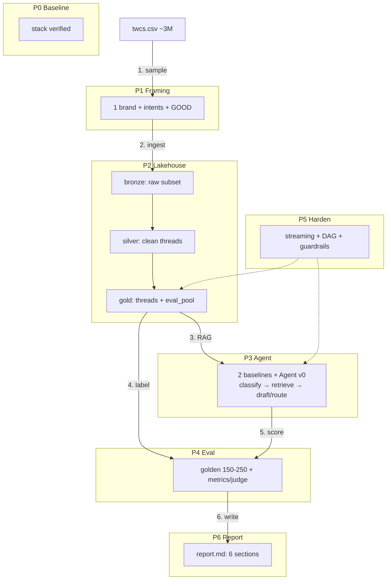
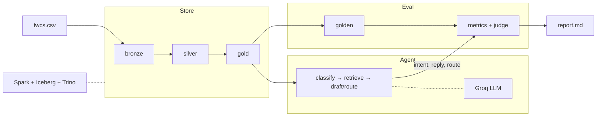

# Integrated Roadmap: Agentic AI + Lakehouse via Hiver

Total: 7 phases. Each phase = AgenticAI concept + Lakehouse concept + Hiver deliverable.
Do them in order. Checkboxes are your definition-of-done.
Corrections and preferences go in `journey/learning-log.md` — the assistant reads it first each session and appends new lessons the same turn they surface.

> **Every concept used below is explained — for beginners — in `/concepts/`** (numbered in the
> order you meet them). Each phase links the concept numbers you should read before building.

## Architecture

### Diagram A — Numbered flow (boxed by phase)

### Diagram B — System view (no phases)

A = build order (follow 1–6). B = running system (left → right).

---

## Phase 0 — Baseline (baseline services installed; exit items NOT yet done)
**AgenticAI:** Python, LLM params (temp/top-k/top-p), 9 prompting techniques, basic tool calling
**Lakehouse:** Week 1 medallion on synthetic trades, RustFS+Spark+Iceberg up
**Concepts first:** [`01`](../concepts/01-what-is-an-llm.md) → [`08`](../concepts/08-tool-calling.md)
**Exit:** `bronze_silver_gold.py` runs; you can explain temp 0 vs 1.0 and Bronze vs Gold
- [ ] Re-run Week 1 pipeline, screenshot RustFS buckets
- [ ] Re-run `tool_calling.py`, explain `bind_tools` flow in your own words in `journey/00-start-here.md`
- [ ] Fill `journey/00-start-here.md` — this gates Phase 1. Do not start framing until the checkboxes above are green.

## Phase 1 — Problem Framing (2-3 days) ← START HERE
**AgenticAI:** intent taxonomy design, task decomposition (classify/draft/route as 3 sub-tasks), what "good" means
**Lakehouse:** data profiling at scale — sampling strategy, no full ingest yet
**Hiver:** §4.1 problem framing + what you chose NOT to build
**Concepts first:** [`15`](../concepts/15-baseline-thinking.md), [`16`](../concepts/16-golden-set-and-sampling.md)
- Pick 1 brand (suggestion: AmericanAir, AppleSupport, or AmazonHelp — high volume, clear intents)
- Download Kaggle `thoughtvector/customer-support-on-twitter` (twcs.csv ~3M rows), profile with pandas on 1% sample only
- Define v0 intent set (6-9 intents, e.g. flight_delay, baggage, refund, booking_change, rude_service, praise, other)
- Write `journey/01-problem-framing.md`
- [ ] Brand chosen + why; v0 intents listed; out-of-scope list; "good = ?" definition

## Phase 2 — Lakehouse Ingest: Twitter Bronze→Silver→Gold (4-6 days)
**AgenticAI:** (supporting) data prep for LLM — thread reconstruction, cleaning for prompts
**Lakehouse:** Weeks 2-3 in practice: Parquet, Iceberg tables, partitioning, MERGE/dedup
**Hiver:** runnable pipeline foundation (§3.1)
**Concepts first:** [`09`](../concepts/09-medallion-architecture.md) → [`11`](../concepts/11-parquet-and-iceberg.md), [`16`](../concepts/16-golden-set-and-sampling.md)
- `lakehouse/` structure:
  - `bronze/` = raw twcs.csv subset (1 brand, immutable, partitioned by `created_at` date)
  - `silver/` = cleaned + thread-reconstructed (join `tweet_id`↔`response_tweet_id`/`in_response_to_tweet_id`), deduped, language-filtered
    - Expect heavy loss here: many inbound tweets have no reply chain (`response_tweet_id` empty) — reconstruct threads FIRST, keep rows as single-tweet threads if that's all the data has, and make "% dropped + why" the centerpiece of `journey/02-lakehouse-ingest.md`.
  - `gold/` = `threads`, `intent_candidates` (weak labels via keywords), `eval_pool` (stratified sample source)
    - Export `eval_pool` (200–300 rows) AS SOON as Silver stabilizes — do NOT wait for Phase 4. Golden labelling runs in parallel with Phase 3; labelling is the long pole.
    - **Holdout rule (blocks eval leakage):** the exact `tweet_id`s in `eval_pool`/`golden.csv` are EXCLUDED from the agent's retrieval index. Retrieval over a golden example's own thread makes RAG trivial and inflates reply scores. Enforce in `agent/graph.py` + `tools.py`, record in `journey/decisions.md`.
- Reuse `bronze_silver_gold.py` pattern, swap trades → tweets. Use Iceberg tables (not just Parquet) — this completes your Week 2.
- [ ] 1-brand subset in `s3a://bronze/tweets/`; silver thread table queryable; gold eval_pool exported as CSV (200-300 rows)
- [ ] Document in `journey/02-lakehouse-ingest.md`: row counts bronze→silver→gold, % dropped + why, partition choice

## Phase 3 — Agent v0: Baselines + Simple Agent (4-5 days)
**AgenticAI:** LangGraph agent with 3 nodes (classify → retrieve → draft+route), few-shot + RAG grounding
**Lakehouse:** Gold tables as retrieval source (brand's historic resolutions)
**Hiver:** §4.2 baselines (trivial + simple) — required
**Concepts first:** [`07`](../concepts/07-agent-loop.md), [`12`](../concepts/12-rag.md) → [`16`](../concepts/16-golden-set-and-sampling.md)
- Baseline A (trivial): keyword/regex classifier + template reply + always-escalate router
- Baseline B (simple): zero-shot Groq classifier + prompt-only drafter (no retrieval)
- Agent v0: LangGraph, tools = `search_historic_resolutions(thread)` (over Gold, with `eval_pool` IDs held out — never over a golden example's own thread), `escalate(reason)`; prompts reuse your `4.prompt_engineering` techniques (start: few-shot + instruction-based, temp 0)
- **Grounding caveat (twcs.csv is ~2017):** retrieved historic resolutions are a *pattern* the brand followed then, not necessarily correct today. Groundedness = "follows the brand's documented historical pattern", never "is correct policy now". This goes in the framing doc and the judge rubric.
- [ ] All 3 run on eval_pool; accuracy + cost/latency logged
- [ ] `journey/03-agent-v0.md`: prompts pasted, 5 errors pasted, what RAG fixed vs didn't

## Phase 4 — Golden Set + Eval Harness (4-6 days, the hard part)
**AgenticAI:** LLM-as-judge rubric, human agreement, failure taxonomy
**Lakehouse:** Week 5 in practice: DQ checks, lineage (which silver version → which golden label → which score)
**Hiver:** §3.2 + §3.3 (150-250 labels, metrics + judge + agreement proof)
**Concepts first:** [`14`](../concepts/14-data-leakage.md), [`16`](../concepts/16-golden-set-and-sampling.md) (+ `17–20` written when this phase starts)
- Hand-label 150-250 from `gold/eval_pool` (stratified by v0 intent + confidence): columns `text, true_intent, good_reply_traits, should_escalate, notes`
- Metrics: intent accuracy/F1, escalation precision/recall, reply: BLEU/ROUGE (auto) + 1-5 judge rubric (groundedness, tone-match, actionability, no-hallucination), and RETRIEVAL: context hit-rate / recall@k — did the right supporting thread actually get retrieved? A RAG failure at retrieval otherwise only shows up indirectly in reply scores.
- Judge model: use a DIFFERENT model (or at least a different prompt + temperature) than the drafter — a judge that shares the drafter's model biases agreement up. State the judge model in `eval/judge.py` and report κ honestly.
- Judge agreement: you re-score 30-50 judge outputs, report Cohen's κ or % agreement
- [ ] `eval/golden.csv` (150+ rows) + `eval/run.py` reproduces headline numbers in <15 min
- [ ] `journey/04-evaluation.md` + mandatory "what's misleading about my headline number" draft

## Phase 5 — Harden: Streaming, Orchestration, Governance (5-7 days, optional for submission, required for mastery)
**AgenticAI:** memory (thread state), guardrails (PII, tone, refusal), tracing, cost control
**Lakehouse:** Weeks 3-4: Structured Streaming file-source backlog, Airflow DAG (ingest→silver→gold→eval), Trino queries, compaction/snapshot expiry
**Concepts first:** `21–25` (written when this phase starts)
- Add: confidence-threshold router, PII redaction pre-LLM, LangSmith/trace log in Silver
- Airflow DAG (or `make pipeline` if Airflow too heavy) + Trino ad-hoc queries over Iceberg
- **Why this is here (honesty in `journey/05-harden.md`):** streaming a *static* twcs.csv is a simulated backlog — it ticks the lakehouse Week-3 checkbox but adds no real insight. State that explicitly in the log; the point is the mechanism (file-source → compact → snapshot expiry), not the data flow.
- [ ] `journey/05-harden.md`: before/after failure examples, DAG screenshot, Trino query results

## Phase 6 — Report + Course Publish (2-3 days)
**AgenticAI + Lakehouse:** synthesis, decision log, next-week plan
**Hiver:** §3.4 report (6 pages) + submission to anurag@hiverhq.com
- `report/report.md`: framing, results vs 2 baselines, top-5 failures with real examples, misleading-number section, next week, 10-15 decisions
- Polish `README.md` run instructions (<15 min repro), push to GitHub public
- [ ] Report complete; repo runnable from clean clone; submission sent
- [ ] Final `journey/06-retro.md`: what you'd teach differently — this closes your self-learning course

---

## Concept Map (where each course topic lands)

| Your course topic | Where Hiver forces you to use it |
|---|---|
| Prompting (few-shot, CoT, ReAct) | Phase 3 classifier/drafter prompts |
| Tool calling (`bind_tools`) | Phase 3 `search_historic_resolutions` tool |
| LangGraph (not yet learned) | Phase 3 agent graph; learn it here, not in isolation |
| Memory, RAG, eval, guardrails | Phases 3-5 (entire agent) |
| Bronze/Silver/Gold, Iceberg, Parquet | Phase 2 (real tweets, not synthetic trades) |
| Streaming, partitioning, MERGE | Phases 2 + 5 |
| Airflow, Trino, compaction | Phase 5 |
| DQ, lineage, governance | Phase 4 (golden provenance) |

## Pacing suggestion
- Hiver-submission fast track: Phases 1→4→6 (~3 weeks at 1-2h/day)
- Full mastery (recommended): all 6 phases (~5-6 weeks). Phases 2+5 complete your lakehouse Weeks 2-5; Phases 3+4 complete your AgenticAI gaps.
